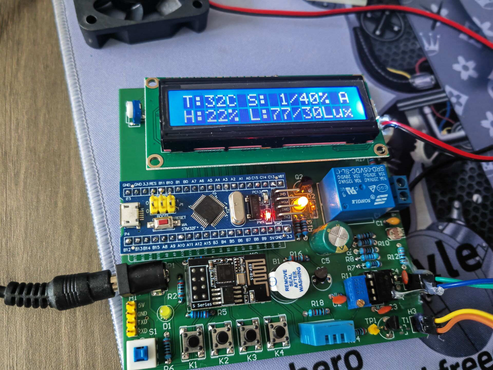
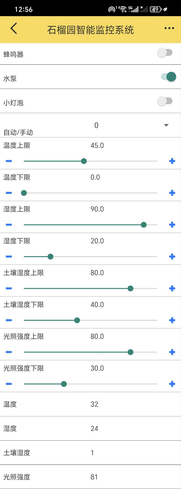

# 🍊 智能果园灌溉监控系统（基于STM32 + ESP8266）

本仓库包含一个 **基于STM32微控制器与ESP8266 WiFi模块** 的智能果园灌溉与环境监控系统的源代码与相关文档。系统集成了多种传感器与控制功能，具备自动监控、远程管理、报警提醒等智能特性，旨在优化果园用水，提高果树产量，降低人工干预成本。

------

## 🚀 项目亮点

- 🌱 **土壤湿度监测与自动灌溉**
   自动检测土壤干湿程度，智能启停水泵/继电器，减少水资源浪费。
- ☀️ **光照强度检测与补光**
   实时监控光照条件，自动控制LED进行补光，保障作物光照充足。
- 🌡️ **环境温湿度监控与报警**
   使用DHT11传感器检测果园温湿度，超过阈值自动报警（蜂鸣器/APP推送）。
- 📱 **本地显示与APP远程控制**
   LCD1602 显示当前环境数据，支持通过 WiFi + 机智云 Gizwits 平台实现远程控制、监控与配置参数。
- 🐦 **驱鸟保护功能**
   使用蜂鸣器+风扇模拟声光反应驱鸟，保护果实安全。
- 🔧 **支持自动 / 手动控制模式切换**
   用户可通过实体按键切换自动与手动模式，自主调节灌溉与LED状态。

------

## 🧰 技术栈

| 技术/模块                    | 描述                                        |
| ---------------------------- | ------------------------------------------- |
| STM32F103                    | 主控MCU，控制所有逻辑、传感器读写与设备动作 |
| ESP8266                      | 实现WiFi通信，接入机智云平台                |
| DHT11                        | 温湿度传感器                                |
| ADC通道 + 比例换算           | 实现土壤湿度与光照强度模拟量采集            |
| LCD1602                      | 实时数据显示                                |
| 蜂鸣器 / 风扇 / LED / 继电器 | 环境反馈与控制输出                          |
| Gizwits SDK                  | 云平台通信与远程控制协议支持                |

------

## 🧩 系统架构图

```
        [ 土壤湿度传感器 ] ┐
        [ 光照传感器     ] ┤
        [ DHT11温湿度传感器 ] ─→ STM32F103 ─→ LCD1602
                               │        │
                               │        ├─→ 继电器（水泵）
                               │        ├─→ LED补光
                               │        ├─→ 蜂鸣器驱鸟
                               │        ├─→ 风扇
                               │
                               └─ESP8266（WiFi）─→ Gizwits云平台 ←→ 手机APP
```

------

## ⚙️ 系统功能说明

| 功能       | 自动模式                | 手动模式            |
| ---------- | ----------------------- | ------------------- |
| 灌溉控制   | 根据土壤湿度自动启停    | 按键控制继电器开关  |
| LED补光    | 根据光照强度自动开关    | 按键控制LED灯       |
| 蜂鸣器报警 | 温湿度异常触发报警      | 手动控制蜂鸣器      |
| 参数配置   | 按键切换设置项、+/-调整 | ✖                   |
| 云平台交互 | 实时上报 / 远程设置     | 实时上报 / 手动开关 |

------

## 🕹️ 使用说明

### 1. 硬件连接

确保如下外设连接至STM32主控板：

- DHT11：温湿度检测（连接至GPIO）
- 土壤湿度与光照传感器：连接至ADC输入（AD0、AD1）
- 蜂鸣器、LED、风扇、继电器：连接至GPIO输出
- ESP8266：通过串口与STM32通信
- LCD1602：并口/串口方式连接，显示实时信息
- 按键：切换模式与参数配置

### 2. 按键功能

| 按键名称 | 功能说明                                   |
| -------- | ------------------------------------------ |
| MODE键   | 切换自动 / 手动模式                        |
| SET键    | 自动模式下切换配置项；手动模式控制LED开关  |
| + 键     | 自动模式下增加阈值；手动模式控制继电器开关 |
| - 键     | 自动模式下减少阈值；手动模式控制蜂鸣器     |

### 3. 显示说明

- 第一行：温度、土壤湿度及工作模式（A/M）
- 第二行：湿度、光照信息
- 设置模式下：LCD将显示当前设置项及数值，并闪烁提示

------

## 🔗 云平台接入

系统集成 [Gizwits 机智云平台](https://www.gizwits.com/)，可实现：

- 实时查看传感器数据
- 远程控制设备开关
- 设置温湿度、光照等报警上下限

**连接方式：**

1. 编译烧录后，系统默认进入 `SoftAP模式`
2. 使用手机APP连接ESP8266发出的WiFi热点
3. 完成配网后即可实现远程控制

------

## 📁 文件结构

```bash
├─assets                  # 📦 项目相关素材资源（如图片、视频、模型等）
├─code                   # 💻 项目核心代码目录
│  ├─.vscode             # ⚙️ VS Code 编辑器配置（如调试/构建配置）
│  ├─DebugConfig         # 🐞 调试相关配置文件（如调试脚本、参数等）
│  ├─Gizwits             # 🌐 Gizwits（机智云）平台相关文件/SDK（用于物联网功能）
│  ├─Hardware            # 🔌 硬件驱动层代码（各类传感器、电机等底层控制）
│  ├─Library             # 📚 引用的库文件（如外设驱动库、第三方库等）
│  ├─Listings            # 🧾 编译后汇编清单、反汇编代码等中间文件
│  ├─Objects             # 🏗️ 编译生成的中间目标文件（.o/.obj）
│  ├─Start               # 🚀 启动文件（如 startup.s、启动配置等）
│  ├─System              # 🧠 系统基础模块（延时、定时器、串口等）
│  │  ├─delay            # ⏱️ 延时函数模块（如 Delay_ms、Delay_us）
│  │  ├─RTC              # 🕒 实时时钟（Real-Time Clock）配置与管理
│  │  ├─sys              # ⚙️ 系统初始化、时钟配置等基础系统函数
│  │  ├─timer            # ⏰ 定时器驱动及相关中断处理
│  │  └─usart            # 📡 串口通信模块（USART 配置、收发函数）
│  ├─User                # 👤 用户应用层逻辑（如主函数、用户接口等）
│  └─Utils               # 🧰 实用工具函数模块（如数据转换、打印函数等）
└─Doc                    # 📄 项目文档资料（说明书、设计文档、技术报告等）
```

------

## 📸 项目实物图 / 视频演示

> 📷实物图和机智云APP控制界面
>
> 
>
> 
>
> B站演示视频：
>
> [基于STM32与ESP8266的果园智能灌溉监控系统_哔哩哔哩_bilibili](https://www.bilibili.com/video/BV11RE5z2E7F/?vd_source=c899b188b620426fe3181bd45fd4e21b)


------

## 📌 开发环境

- 开发板：STM32F103C8T6（或其他STM32F1系列）
- IDE：Keil MDK5
- 串口调试助手：支持串口透传
- 烧录工具：ST-Link
- 手机APP：机智云 Gizwits App

